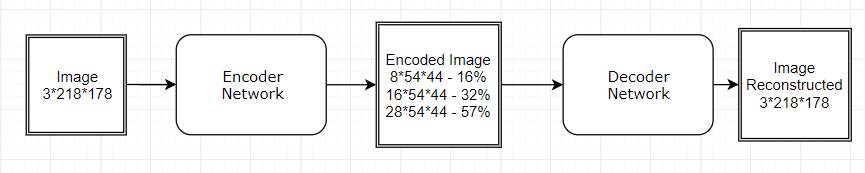
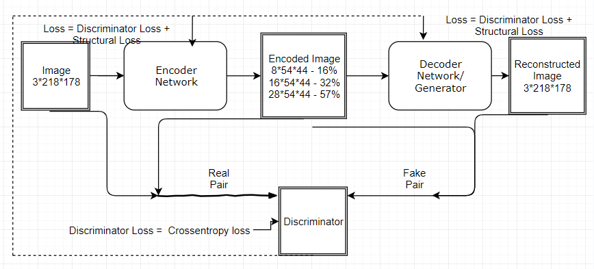
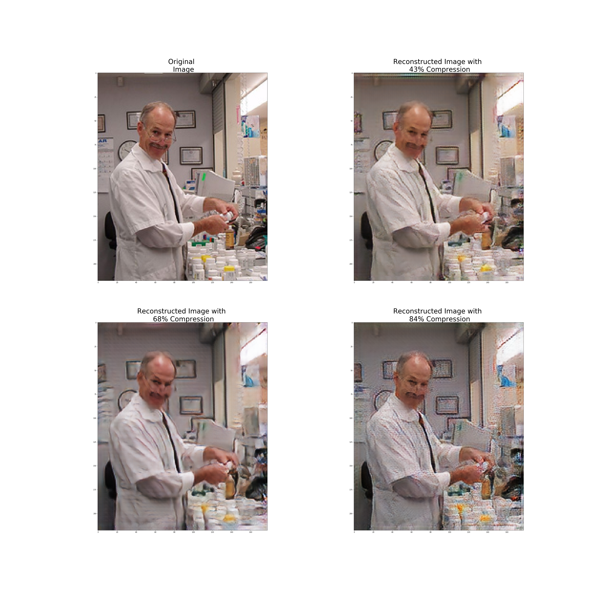

# Image Compression using GAN

Image compression is one of the fundamental problems of information theory. In a simple setting, we can use Encoder-Decoder models based on deep neural networks trained with L1 and L2 loss. The problem with this approach is that the reconstruction of the image from compressed format is not realistic, miss a lot of detail and is often blurry.

We addressed this problem using a novel approach based on Generative Adversarial Networks.
In order to address the various types of artifacts introduced during the reconstruction of the compressed image, we have chosen a multi-variate loss function (structural loss + adversarial loss).

Coming to network architectures, for Compressor and Decompressor Networks, we have used custom architecture with just under 4 layers based on residual layers(ResNet). For Discriminator i.e., the classifier which labels whether given pair is real or fake we have chosen a simple model based on a combination of convolution and dropout layers.

Using the proposed architectures and loss function we were able to achieve compression rates of 43% 68%,84% and also reconstruct images that are similar to the original image.

Source Code Available at :
https://www.kaggle.com/crbanala/image-compression-using-gan-2

The Network Flow is as follows :

The models are trained in GAN fashion :

Image Compression using GAN

<b> RESULTS : </b>

